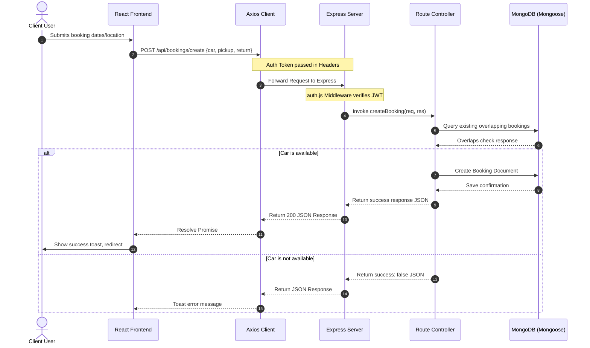

# AI Context - DrivRent

This document provides a comprehensive overview of the DrivRent codebase. It is designed to help AI coding assistants quickly understand the architecture, flows, models, APIs, and conventions of the project.

---

## Project Overview

- **Project Name:** DrivRent
- **Purpose:** A peer-to-peer car rental platform that connects car owners (who want to list and monetize their vehicles) with users (renters who want to search, check availability, and book cars).
- **Tech Stack:**
  - **Frontend:** React 19 (Vite), React Router v7, Tailwind CSS v4, Motion (animations), Axios, React Hot Toast.
  - **Backend:** Node.js, Express.js (v5), Mongoose (MongoDB), Multer, JWT (jsonwebtoken), Bcrypt.
  - **External Services:** ImageKit (cloud image storage, compression, and WebP transformation).
- **Main Features:**
  - User registration & login with role-based dashboard redirection.
  - Interactive car search, keyword filtering, and date/location-based availability verification.
  - Complete booking workflow (requesting, checking availability, calculating costs per day, and tracking statuses).
  - Owner onboarding flow (switching roles from renter to owner).
  - Owner dashboard for listing vehicles (with image upload & optimization), toggling car availability, soft-deleting cars, and managing rental bookings (confirming or cancelling).
  - Profile image uploads and automated resizing via ImageKit transformation.

---

## Folder Structure

```text
drivrent/
├── client/                     # Frontend React application
│   ├── public/                 # Static assets
│   ├── src/                    # React source code
│   │   ├── assets/             # Images, icons, static data
│   │   ├── components/         # Reusable presentation components
│   │   │   └── owner/          # Owner-dashboard specific components (Sidebar, NavbarOwner, etc.)
│   │   ├── context/            # React Context state providers (AppContext.jsx)
│   │   ├── pages/              # Page components (Home, Cars, CarDetails, MyBooking)
│   │   │   └── owner/          # Owner dashboard pages (Layout, Dashboard, AddCar, ManageCars, ManageBookings)
│   │   ├── App.jsx             # Main Router and layout hub
│   │   ├── main.jsx            # React root mount point
│   │   └── index.css           # Global CSS and Tailwind directives
│   ├── package.json            # Frontend dependencies and scripts
│   └── vite.config.js          # Vite configuration
│
├── server/                     # Backend Express application
│   ├── configs/                # Configuration modules (database, third-party APIs)
│   ├── controllers/            # Request handlers / Business logic
│   ├── middlewares/            # Express middlewares (authentication, file uploads)
│   ├── models/                 # Mongoose (MongoDB) database schemas
│   ├── routes/                 # Express API routes
│   ├── server.js               # Entry point of the Express server
│   └── package.json            # Backend dependencies and scripts
│
└── docs/                       # Project documentation directory (this directory)
```

### Major Files Responsibility
- `client/src/context/AppContext.jsx`: Centralizes authentication state, currency configuration, loading flags, current search parameters (`pickupDate`, `returnDate`), available cars list, and shared API utility functions.
- `server/server.js`: Sets up Express middleware (CORS, JSON parser), connects to MongoDB, mounts routers, and starts the server.
- `server/middlewares/auth.js`: Verifies incoming request authentication. Cryptographically validates JWT signatures using `jwt.verify` against `JWT_SECRET`. Also contains `verifyOwner` middleware to restrict access to owner roles.
- `server/configs/imageKit.js`: Configures the connection to ImageKit using key credentials.

---

## Frontend Architecture

### React Router Structure
The application uses `react-router-dom` (v7) for client-side routing.
- **Root/User Layout:** Renders `Navbar` at the top and `Footer` at the bottom unless the path starts with `/owner`.
- **Owner Dashboard Layout:** Uses nested routes with `Layout.jsx` (which contains `Sidebar` and `NavbarOwner`) and renders sub-views inside an `<Outlet />`.

**Declared Routes:**
- `/` (`Home.jsx`): Landing page featuring Hero search, features, banners, testimonials, and a newsletter signup.
- `/cars` (`Cars.jsx`): Lists cars. Filters by URL search queries (`pickupLocation`, `pickupDate`, `returnDate`) or keyword search.
- `/car-details/:id` (`CarDetails.jsx`): Detailed view of a single car, allowing the user to select rental dates and place a booking.
- `/my-bookings` (`MyBooking.jsx`): Renders a list of the renter's current and past bookings.
- `/owner` (`Layout.jsx`): Layout wrapper for owner functionalities.
  - `/owner` (Index: `Dashboard.jsx`): Displays owner performance metrics, monthly revenue, and recent bookings.
  - `/owner/add-car` (`AddCar.jsx`): Form to upload a car image and fill out specifications.
  - `/owner/manage-cars` (`ManageCars.jsx`): List of owner's vehicles with options to toggle availability or remove them.
  - `/owner/manage-bookings` (`ManageBookings.jsx`): Table of rental requests with Accept/Cancel actions.

### State Management & Context Providers
- **`AppContext`:** Declares states for:
  - `token` (String): Stored JWT token from `localStorage`.
  - `user` (Object): The authenticated user profile.
  - `isOwner` (Boolean): Flag representing whether the user's role is `"owner"`.
  - `cars` (Array): Full list of active, available cars in the system.
  - `pickupDate` / `returnDate` (String): Inputs filled in by the user during search to carry over into the booking page.
  - `showLogin` (Boolean): Toggles the registration/login modal.
  - `loading` (Boolean): Flag representing whether the user profile and session validation is in progress. Reactivated to `true` during login token updates until profile resolution completes.
- **Shared Functions:** `fetchUser()`, `fetchCars()`, `logout()`.

### Auth, Booking & Owner Dashboard Flows
- **Authentication Flow:** User clicks "Login/Sign Up" in the Navbar -> `Login` modal displays with a role selector ("User" or "Owner") -> submitting makes an Axios call to `/api/user/login` or `/api/user/register` passing the chosen `role` -> Server validates details, verifies selected role matches the database entry (for logins), and returns JWT token and confirmed `role` -> React saves token to `localStorage` and state -> redirects Users to `/` and Owners to `/owner`.
- **Booking Flow:** User searches by location/dates on Homepage -> Redirects to `/cars?pickupLocation=...` -> calls `/api/bookings/check-availability` -> User selects a car to navigate to `/car-details/:id` -> clicks "Book Now" -> calls `/api/bookings/create` -> Redirects to `/my-bookings` with status `"pending"`.
- **Owner Dashboard Flow:** Owners who log in with the `"Owner"` role are automatically redirected to `/owner` and can access `/owner/add-car`, `/owner/manage-cars`, `/owner/manage-bookings`. *Note on page refresh:* The layout guard waits until `loading` is false. If the user is verified as an owner, they remain on their active page. If the validation fails (or user role is not owner), they are redirected to `/` and the Login modal automatically opens.

---

## Backend Architecture

### Config Files
- `server/configs/db.js`: Establishes connections using `mongoose.connect(process.env.MONGODB_URI)`.
- `server/configs/imageKit.js`: Exports the initialized `@imagekit/nodejs` SDK instance.

### Middlewares
- `auth.js` (`protect`): Extracts Authorization token from request headers, cryptographically validates the token signature using `jwt.verify` against `JWT_SECRET`, fetches the User from the database (excluding password), and appends it to `req.user`.
- `auth.js` (`verifyOwner`): Middleware that checks if the verified user has `role === "owner"`. Used to guard all owner routes on the server side.
- `multer.js` (`upload`): Configures local file handling using disk storage to write temporary files before uploading them to ImageKit.

---

## Database (Mongoose Models)

### `User` Model
```javascript
{
  name: { type: String, required: true },
  email: { type: String, required: true, unique: true },
  password: { type: String, required: true },
  role: { type: String, enum: ["owner", "user"], default: "user" },
  image: { type: String, default: "" }
}
// Timestamps: true
```

### `Car` Model
```javascript
{
  owner: { type: mongoose.Schema.Types.ObjectId, ref: 'User' },
  brand: { type: String, required: true },
  model: { type: String, required: true },
  image: { type: String, required: true },
  year: { type: Number, required: true },
  category: { type: String, required: true },
  seating_capacity: { type: Number, required: true },
  fuel_type: { type: String, required: true },
  transmission: { type: String, required: true },
  pricePerDay: { type: Number, required: true },
  location: { type: String, required: true },
  description: { type: String, required: true },
  isAvailable: { type: Boolean, default: true }
}
// Timestamps: true
```
*Note on deletion:* Removing a car does not delete the document. It soft-deletes by setting `owner = null` and `isAvailable = false`.

### `Booking` Model
```javascript
{
  car: { type: mongoose.Schema.Types.ObjectId, ref: "Car", required: true },
  user: { type: mongoose.Schema.Types.ObjectId, ref: "User", required: true },
  owner: { type: mongoose.Schema.Types.ObjectId, ref: "User", required: true },
  pickupDate: { type: Date, required: true },
  returnDate: { type: Date, required: true },
  status: { type: String, enum: ["pending", "confirmed", "cancelled"], default: "pending" },
  price: { type: Number, required: true }
}
// Timestamps: true
```

---

## API Endpoints

| Method | Endpoint | Controller Function | Middleware | Request Body | Response Success Shape | Frontend Caller Component |
| :--- | :--- | :--- | :--- | :--- | :--- | :--- |
| **POST** | `/api/user/register` | `registerUser` | None | `{ name, email, password, role }` | `{ success: true, token, role }` | `Login.jsx` |
| **POST** | `/api/user/login` | `loginUser` | None | `{ email, password, role }` | `{ success: true, token, role }` | `Login.jsx` |
| **GET** | `/api/user/data` | `getUserData` | `protect` | None | `{ success: true, user }` | `AppContext.jsx` |
| **GET** | `/api/user/cars` | `getCars` | None | None | `{ success: true, cars }` | `AppContext.jsx` |
| **POST** | `/api/owner/add-car` | `addCar` | `protect`, `verifyOwner`, `upload.single("image")` | `multipart/form-data` with fields `carData` (JSON) and file `image` | `{ success: true, message: "Car Added" }` | `owner/AddCar.jsx` |
| **GET** | `/api/owner/cars` | `getOwnerCars` | `protect`, `verifyOwner` | None | `{ success: true, cars }` | `owner/ManageCars.jsx` |
| **POST** | `/api/owner/toggle-car` | `toggleCarAvailability` | `protect`, `verifyOwner` | `{ carId }` | `{ success: true, message: "..." }` | `owner/ManageCars.jsx` |
| **POST** | `/api/owner/delete-car` | `deleteCar` | `protect`, `verifyOwner` | `{ carId }` | `{ success: true, message: "Car Removed" }` | `owner/ManageCars.jsx` |
| **GET** | `/api/owner/dashboard` | `getDashboardData` | `protect`, `verifyOwner` | None | `{ success: true, dashboardData }` | `owner/Dashboard.jsx` |
| **POST** | `/api/owner/update-image` | `updateUserImage` | `protect`, `verifyOwner`, `upload.single("image")` | `multipart/form-data` with file `image` | `{ success: true, message: "Image Updated" }` | `owner/Sidebar.jsx` |
| **POST** | `/api/bookings/check-availability` | `checkAvailabilityOfCar` | None | `{ location, pickupDate, returnDate }` | `{ success: true, availableCars }` | `Cars.jsx` |
| **POST** | `/api/bookings/create` | `createBooking` | `protect` | `{ car, pickupDate, returnDate }` | `{ success: true, message: "Booking Created" }` | `CarDetails.jsx` |
| **GET** | `/api/bookings/user` | `getUserBookings` | `protect` | None | `{ success: true, bookings }` | `MyBooking.jsx` |
| **GET** | `/api/bookings/owner` | `getOwnerBookings` | `protect` | None | `{ success: true, bookings }` | `owner/ManageBookings.jsx` |
| **POST** | `/api/bookings/change-status` | `changeBookingStatus` | `protect` | `{ bookingId, status }` | `{ success: true, message: "Status Updated" }` | `owner/ManageBookings.jsx` |

---

## Authentication & Routing Architecture

- **JWT Flow:**
  - Token is generated with user ID on registration or login.
  - Stored in the frontend browser's `localStorage` as `token`.
  - Sent on subsequent authenticated requests via the HTTP headers as: `Authorization: <token>`.
- **Protected Routes & Role-Based Authorization (Backend):**
  - The `protect` middleware intercepts requests, extracts the token, verifies the cryptographic signature against the `JWT_SECRET`, and attaches the matching `User` object (excluding password) to the request context.
  - The `verifyOwner` middleware ensures that only users with the `"owner"` role can hit administrative endpoint routes.
- **Renter/Owner Logic:**
  - Users select their role (`"user"` or `"owner"`) during registration or login.
  - The server verifies that the logging-in user's role matches the selected role.
  - In Mongoose schemas, bookings and cars reference the owner and the renter user specifically using distinct ObjectId fields.
- **Route Guard Strategy & Navigation Flow (Frontend):**
  - **Route Guards** are enforced globally in `App.jsx` using dedicated wrapper components that observe the central `loading`, `token`, and `isOwner` states from `AppContext`:
    - `PublicRoute`: Wraps public-only user pages (like `/`, `/cars`, `/car-details/:id`). If an authenticated owner attempts to access these pages, they are automatically redirected to `/owner` via history replacement (`replace: true`).
    - `RenterProtectedRoute`: Wraps renter-specific protected pages (like `/my-bookings`). If the user is unauthenticated, it opens the login modal and redirects to `/`. If the user is authenticated as an owner, it redirects to `/owner` (with `replace: true`).
    - `OwnerProtectedRoute`: Wraps all owner-specific pages under `/owner/*`. If the user is unauthenticated, it triggers the login modal and redirects to `/`. If the user is authenticated as a renter (non-owner), it redirects to `/`.
  - **Browser History & Back-Button Protection:**
    - Redirects after successful authentication (via `Login.jsx`) utilize history replacement (`replace: true`). This replaces the login page/modal entry in history, ensuring that pressing the browser Back button does not navigate back to the login modal or expose stale landing pages.
    - Protected redirects (via `Navigate replace`) modify history in place, preventing history pollutions and loop scenarios.
  - **Session Refresh Persistence:**
    - During page refresh, the `loading` state remains `true` until the JWT session is resolved and user details are loaded. The route guards render `<Loader />` and defer redirect evaluations, preventing unauthorized redirection bugs.
  - **Login Modal Prevention:**
    - To prevent authenticated users from opening the login or register views, `AppContext.jsx` actively watches the `token` state and resets `showLogin` to `false` when authentication is active.


---

## External Services

- **ImageKit:**
  - Configured with `IMAGEKIT_PUBLIC_KEY`, `IMAGEKIT_PRIVATE_KEY`, and `IMAGEKIT_URL_ENDPOINT` variables.
  - Used for hosting profile photos (under `/users` folder) and listing photos (under `/cars` folder).
  - Leverages ImageKit helper transformations to enforce auto-compression (`quality: "auto"`), resizing (widths of `400px` for users and `1280px` for cars), and modern formats (`format: "webp"`).
- **Axios:**
  - Configured in `AppContext.jsx` with base URL via `axios.defaults.baseURL = import.meta.env.VITE_BASE_URL`.
  - Authorization headers are globally attached inside a `useEffect` watching the token change.
- **Environment Variables:**
  - **Backend (`.env`):** `MONGODB_URI`, `PORT`, `JWT_SECRET`, `IMAGEKIT_PUBLIC_KEY`, `IMAGEKIT_PRIVATE_KEY`, `IMAGEKIT_URL_ENDPOINT`.
  - **Frontend (`.env`):** `VITE_BASE_URL` (backend host), `VITE_CURRENCY` (default display currency symbol, e.g. `$`).

---

## Data Flow



---

## Coding Conventions

- **Naming Conventions:**
  - Backend files: camelCase (e.g. `userController.js`, `bookingRoutes.js`).
  - Frontend components: PascalCase (e.g. `CarCard.jsx`, `ManageBookings.jsx`).
  - Database Models: PascalCase (e.g. `User.js`, `Car.js`).
- **Error Handling:**
  - Backend controllers wrap actions in `try/catch` and return errors as JSON responses: `{ success: false, message: error.message }` rather than throwing standard HTTP status codes (e.g., 400, 401, 500).
- **Toast Usage:**
  - `react-hot-toast` is initialized with `<Toaster />` in `App.jsx`.
  - Alerts are rendered dynamically using `toast.success(...)`, `toast.error(...)`, or `toast(...)` based on response status flags.

---

## Project Summary

DrivRent functions as a MERN peer-to-peer car sharing ecosystem. Renter profiles browse and check vehicle availability for specific date spans and locations. Once a booking is created, it transitions to a pending state. Owners utilize their specialized dashboard interface to approve, confirm, or reject incoming reservations, oversee their vehicle listings, toggle individual car availability, and review overall revenue performance. All images are optimized on upload using ImageKit's transformation middleware to maintain high application performance.
